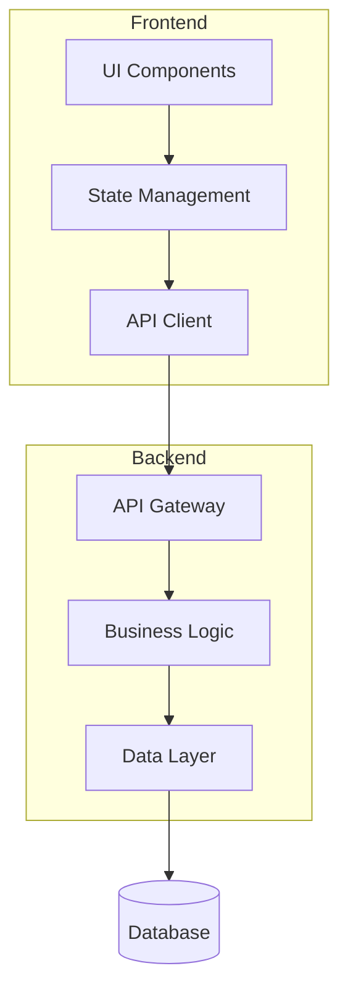

# Guia de Implementação - CDD v2.0

## 🚀 Setup Inicial Completo

### Passo 1: Criar Estrutura Base Robusta

```bash
# Criar estrutura principal completa
mkdir -p .kiro/steering
mkdir -p .kiro/patterns/{frontend,backend,database,examples,linting}
mkdir -p .kiro/scripts
mkdir -p .kiro/specs/_template
mkdir -p .kiro/docs

# Arquivos obrigatórios do steering
touch .kiro/steering/product.md
touch .kiro/steering/structure.md  
touch .kiro/steering/tech.md

# Arquivos patterns obrigatórios
touch .kiro/patterns/README.md
touch .kiro/patterns/conventions.md
touch .kiro/patterns/architecture.md
touch .kiro/patterns/typescript.md

# Scripts de automação essenciais
touch .kiro/scripts/package.json
touch .kiro/scripts/task-manager.js
touch .kiro/scripts/install.sh
chmod +x .kiro/scripts/*.sh

echo "✅ Estrutura CDD v2.0 criada!"
```

### Passo 2: Setup de Automação Obrigatório

```bash
# Inicializar sistema de tracking
cd .kiro/scripts
npm init -y

# Instalar dependências essenciais para automação
npm install --save-dev fs-extra glob chalk inquirer

# Configurar scripts básicos
cat > package.json << 'EOF'
{
  "name": "kiro-automation",
  "version": "2.0.0",
  "scripts": {
    "scan": "node task-manager.js scan",
    "list": "node task-manager.js list",
    "status": "node task-manager.js status",
    "complete": "node task-manager.js complete",
    "watch": "node task-manager.js watch",
    "report": "node task-manager.js report",
    "validate": "./validate-task-format.sh",
    "backup": "./backup-tasks.sh",
    "cleanup": "./weekly-cleanup.sh",
    "health": "./health-dashboard.sh"
  }
}
EOF

echo "✅ Sistema de automação configurado!"
```

### Passo 3: Configurar Template com Task IDs

```bash
# Template para novas funcionalidades
cd .kiro/specs/_template

# Template requirements.md
cat > requirements.md << 'EOF'
# Requirements - [Nome da Funcionalidade]

## Introduction

[Breve contexto da funcionalidade, por que é necessária e como se encaixa no produto geral]

## Requirements

### Requirement 1: [Nome Descritivo]

**User Story:** Como [tipo específico de usuário], eu quero [funcionalidade/ação específica], para que [benefício mensurável/objetivo claro].

#### Acceptance Criteria

1. **GIVEN** [contexto/estado inicial] **WHEN** [ação do usuário] **THEN** o sistema **SHALL** [comportamento esperado específico]
2. **GIVEN** [situação específica] **WHEN** [evento/trigger] **THEN** o sistema **SHALL** [resposta do sistema]
3. **GIVEN** [condição especial] **WHEN** [interação] **THEN** o sistema **SHALL** [tratamento especial]
4. **GIVEN** [cenário de erro] **WHEN** [falha ocorre] **THEN** o sistema **SHALL** [recuperação/fallback com UX]

#### Business Rules

- **BR1**: [Regra de negócio específica com rationale]
- **BR2**: [Regra de validação com consequências]

#### Dependencies

- **Technical**: [Dependência de API/sistema/componente]
- **Business**: [Dependência de processo/approval/data]

#### Success Metrics

- **Primary KPI**: [Métrica principal] - Target: [X%/number]
- **Secondary KPI**: [Métrica de suporte] - Target: [Y%/number]
EOF

# Template design.md
cat > design.md << 'EOF'
# Design Document - [Nome da Funcionalidade]

## Overview

[Visão geral da solução técnica, abordagem escolhida e principais componentes]

## Architecture

### High-Level Architecture



### Component Breakdown

#### Component A
- **Purpose**: [Responsabilidade específica]
- **Technology**: [Tecnologia/biblioteca usada]
- **Dependencies**: [Do que depende]

## Data Flow

### Main Flow
1. **Input**: [Entrada do usuário/sistema]
2. **Validation**: [Validações aplicadas]
3. **Processing**: [Processamento realizado]
4. **Storage**: [Como dados são armazenados]
5. **Response**: [Resposta ao usuário]

## Technical Decisions

| Decision | Alternatives | Rationale | Trade-offs |
|----------|-------------|-----------|------------|
| Library X | Library Y, Z | Performance + community | Learning curve |

## Security Considerations

- **Authentication**: [Como implementado]
- **Authorization**: [Controle de acesso]
- **Data Validation**: [Validações de entrada]
- **Audit Logging**: [Logs de auditoria]

## Performance Considerations

- **Caching Strategy**: [Estratégia de cache]
- **Database Optimization**: [Otimizações]
- **Bundle Size**: [Considerações de tamanho]
EOF

# Template tasks.md com Task IDs obrigatórios
cat > tasks.md << 'EOF'
# [Feature Name] - Implementation Plan

## Overview
[Visão geral do plano de implementação e abordagem]

## 🎯 Success Criteria
- [ ] [Critério mensurável 1]
- [ ] [Critério mensurável 2]
- [ ] [Critério mensurável 3]

## 📋 Task Breakdown (IDs Obrigatórios)

### Phase 1: Foundation
- [ ] 1.1 Setup base structure
  - [ ] Create main component files
  - [ ] Setup routing configuration
  - [ ] Define TypeScript interfaces
  - [ ] Setup test files structure
  - _Requirements: [1.1, 1.2]_
  - _Estimated: 2h_
  - _Dependencies: none_
  - **Task ID**: `[feature-name]-1.1`

- [ ] 1.2 Implement core business logic
  - [ ] Business logic implementation
  - [ ] Data validation rules
  - [ ] Error handling framework
  - _Requirements: [2.1, 2.2]_
  - _Estimated: 4h_
  - _Dependencies: [1.1]_
  - **Task ID**: `[feature-name]-1.2`

### Phase 2: User Interface
- [ ] 2.1 Create base UI components
  - [ ] Main layout components
  - [ ] Form components (if applicable)
  - [ ] Loading states
  - [ ] Error states
  - _Requirements: [3.1, 3.2]_
  - _Estimated: 6h_
  - _Dependencies: [1.1, 1.2]_
  - **Task ID**: `[feature-name]-2.1`

### Phase 3: Integration
- [ ] 3.1 API development
  - [ ] RESTful endpoints
  - [ ] Authentication middleware
  - [ ] Input validation (server-side)
  - _Requirements: [4.1, 4.2]_
  - _Estimated: 5h_
  - _Dependencies: [1.2]_
  - **Task ID**: `[feature-name]-3.1`

### Phase 4: Testing & Documentation
- [ ] 4.1 Unit testing
  - [ ] Component unit tests
  - [ ] Service layer tests
  - [ ] Edge case coverage
  - _Requirements: All_
  - _Estimated: 4h_
  - _Dependencies: [2.1, 3.1]_
  - **Task ID**: `[feature-name]-4.1`

## 🤖 Tracking Commands (Obrigatórios)

### Durante o Desenvolvimento:
```bash
# Ver tasks disponíveis
npm run list [feature-name]

# Marcar task como concluída (OBRIGATÓRIO)
npm run complete [feature-name]-1.1
npm run complete [feature-name]-1.2
# ... continue para cada task

# Monitoramento em tempo real
npm run watch
```

### Validação e Backup:
```bash
# Validação de formato
npm run validate [feature-name]

# Backup automático
npm run backup

# Health check
npm run health
```

## Dependencies & Prerequisites

### Task Dependencies
- **1.1 → 1.2**: Base structure before logic
- **1.1, 1.2 → 2.1**: Foundation before UI
- **1.2 → 3.1**: Logic before API
- **2.1, 3.1 → 4.1**: Implementation before testing

### External Dependencies
- [ ] Design system components ready
- [ ] API infrastructure setup
- [ ] Development environment configured

## Definition of Done

### Functional Completion
- [ ] All user stories implemented and tested
- [ ] All acceptance criteria verified
- [ ] Error handling implemented
- [ ] Task IDs properly tracked

### Quality Gates
- [ ] Unit tests passing (>90% coverage)
- [ ] Code reviewed and approved
- [ ] Patterns compliance verified
- [ ] Documentation updated

### Tracking Completion
- [ ] All tasks marked with `npm run complete`
- [ ] Progress reported to stakeholders
- [ ] Metrics tracking implemented
EOF

echo "✅ Templates com Task IDs configurados!"
```

## 📝 Preenchendo o Steering (CDD v2.0)

### 1. Product.md - Visão Estratégica

```markdown
# [Nome do Projeto] - Visão de Produto

## Problema que Resolve

### Context
[Descreva o contexto atual e o problema identificado]

### Pain Points
- **Dor Principal**: [Principal problema com métricas]
- **Dores Secundárias**: [Problemas relacionados]
- **Impacto Mensurado**: [Dados que demonstram o problema]

### Target Users
- **Usuário Primário**: [Persona principal com dados]
- **Usuários Secundários**: [Outras personas]
- **Anti-usuário**: [Quem NÃO é o público]

## Solução Proposta

### Value Proposition
[Uma frase que resume o valor único do produto]

### Core Features
1. **Feature 1**: [Funcionalidade + benefício + métrica]
   - **Priority**: P0 (Critical)
   - **Success Metric**: [Como medir]
2. **Feature 2**: [Segunda funcionalidade]
   - **Priority**: P1 (High)
   - **Success Metric**: [Como medir]

## Objetivos de Negócio (Mensuráveis)

### Success Metrics
- **KPI Principal**: [Métrica] - Target: [X%]
- **KPI Secundário**: [Métrica] - Target: [Y users/month]

### Timeline com Gates
- **Discovery**: [Data] - [Gate: Research completed]
- **MVP**: [Data] - [Gate: Core features working]
- **V1.0**: [Data] - [Gate: Production ready]

### ROI Expectations
- **Development Cost**: [Estimativa]
- **Expected Revenue/Savings**: [Projeção]
- **Break-even**: [Timeline]

## Success Criteria
- [ ] [Critério mensurável 1]
- [ ] [Critério mensurável 2]
- [ ] [Critério mensurável 3]
```

### 2. Structure.md - Arquitetura de Informação

```markdown
# Organização & Estrutura - CDD v2.0

## Filosofia de Organização

[Explique os princípios que guiam a organização do projeto]

### Separation of Concerns
- **Feature-based**: Organização por funcionalidades
- **Layer-based**: Separação por responsabilidades
- **Shared**: Componentes compartilhados

## Estrutura de Diretórios Detalhada

```
projeto/
├── src/                           # Código fonte principal
│   ├── components/                # Componentes reutilizáveis
│   │   ├── ui/                    # Componentes básicos
│   │   ├── forms/                 # Componentes de formulário
│   │   └── business/              # Componentes específicos
│   ├── features/                  # Features por domínio
│   ├── services/                  # Lógica de negócio
│   ├── utils/                     # Utilitários puros
│   └── types/                     # Definições TypeScript
├── tests/                         # Testes automatizados
└── .kiro/                         # CDD v2.0 structure
    ├── steering/                  # Direcionamento
    ├── patterns/                  # Padrões rígidos
    ├── scripts/                   # Automação
    └── specs/                     # Especificações
```

## Convenções de Nomenclatura (Rígidas)

### Arquivos
- **Componentes React**: `PascalCase.tsx`
- **Pages/Rotas**: `kebab-case.tsx`
- **Utilities**: `camelCase.ts`
- **Constants**: `UPPER_SNAKE_CASE.ts`
- **Types**: `camelCase.types.ts`
- **Tests**: `filename.test.ts`

### Diretórios
- **Geral**: `kebab-case`
- **Componentes**: `PascalCase`
- **Features**: `kebab-case`

### Padrões de Import (Obrigatórios)

```typescript
// 1. External libraries (alfabética)
import React from 'react';
import axios from 'axios';

// 2. Internal modules (absolute paths - alfabética)
import { Button } from '@/components/ui/Button';
import { UserService } from '@/services/UserService';

// 3. Relative imports (alfabética)
import { validateForm } from '../utils/validation';
import './Component.css';

// 4. Type-only imports (separados)
import type { User } from '@/types/user.types';
```

## Anti-Patterns (Proibidos)

### ❌ NÃO FAÇA
- **Nomes genéricos**: `Component1.tsx`, `utils.ts`
- **Imports relativos longos**: `../../../components/Button`
- **Arquivos monolíticos**: Mais de 300 linhas
- **CSS inline**: Usar `style={{}}` exceto dinâmico

### ✅ FAÇA
- **Nomes descritivos**: `UserProfileCard.tsx`
- **Absolute paths**: `@/components/Button`
- **Modularização**: Máximo 200-250 linhas
- **CSS modules/Styled**: Componentização
```

### 3. Tech.md - Decisões Técnicas Robustas

```markdown
# Stack Tecnológico & Decisões - CDD v2.0

## Arquitetura

### Pattern
[Padrão arquitetural - Clean Architecture, Feature-Sliced Design, etc.]

### Separation of Concerns
- **Presentation Layer**: [UI components, pages, styling]
- **Business Layer**: [Services, domain logic, state]
- **Data Layer**: [API calls, caching, persistence]
- **Integration Layer**: [External services, APIs]

## Stack Principal (com Versões e Justificativas)

### Frontend
- **Framework**: [Ex: React 18.2+] - [Concurrent features + ecosystem]
- **Language**: [Ex: TypeScript 5.0+] - [Type safety + DX]
- **Build Tool**: [Ex: Vite 4.0+] - [Performance + DX]
- **Styling**: [Ex: Tailwind CSS 3.3+] - [Utility-first + tree-shaking]
- **State Management**: [Ex: Zustand 4.3+] - [Simplicidade + TS]
- **Testing**: [Ex: Vitest + Testing Library] - [Speed + DX]

### Backend
- **Framework**: [Ex: Node.js 18+ + Express 4.18+]
- **Database**: [Ex: PostgreSQL 15+] - [ACID + JSON support]
- **ORM**: [Ex: Prisma 4.13+] - [Type safety + migrations]
- **Authentication**: [Ex: JWT + bcrypt] - [Stateless + secure]

### DevOps & Infrastructure
- **Containerization**: [Ex: Docker + Docker Compose]
- **Deployment**: [Ex: Vercel + Railway]
- **CI/CD**: [Ex: GitHub Actions] - [Automated testing]
- **Monitoring**: [Ex: Sentry + Analytics]

## Comandos Essenciais (Automatizados)

### Development
```bash
# Instalar dependências
pnpm install

# Desenvolvimento local
pnpm dev              # Frontend (port 3000)
pnpm dev:backend      # Backend (port 3001)
pnpm dev:full         # Ambos simultaneamente

# Testes
pnpm test             # Run all tests
pnpm test:watch       # Watch mode
pnpm test:coverage    # Coverage report

# Linting & Formatting
pnpm lint             # ESLint check
pnpm lint:fix         # ESLint auto-fix
pnpm format           # Prettier format
pnpm type-check       # TypeScript check

# CDD Automation
npm run scan          # Scan tasks
npm run status        # Check progress
npm run complete      # Mark task complete
npm run watch         # Monitor progress
npm run health        # Project health
```

## Decisões Técnicas (com Trade-offs)

| Decisão | Alternativas | Motivo da Escolha | Trade-offs |
|---------|-------------|-------------------|------------|
| React 18+ | Vue 3, Angular | Ecosystem + Concurrent features | Bundle size |
| TypeScript | JavaScript | Type safety + DX | Learning curve |
| Tailwind | Styled-components | Rapidez + Tree-shaking | Verbosidade |
| PostgreSQL | MongoDB, MySQL | ACID + JSON + performance | Complexidade |
| Prisma | TypeORM | Type safety + Studio | Vendor lock-in |

## Performance Targets

### Frontend
- **First Contentful Paint**: < 1.5s
- **Bundle Size**: < 250KB (gzipped)
- **Lighthouse Score**: > 90

### Backend
- **Response Time**: < 200ms (95th percentile)
- **Throughput**: > 1000 req/sec
- **Uptime**: > 99.9%

## Security Considerations

### Authentication & Authorization
- **JWT expiration**: 15 min (access) + 7 days (refresh)
- **Rate limiting**: 100 req/min per IP
- **Password policy**: 8+ chars, complexity required

### Data Protection
- **Encryption**: AES-256 at rest, TLS 1.3 in transit
- **Input validation**: Zod schemas frontend + backend
- **CORS policy**: Strict origin whitelist
```

## 🎯 Patterns - Padrões Rígidos (Novo no CDD v2.0)

### Setup Inicial de Patterns

```bash
# Configurar patterns básicos
cd .kiro/patterns

# README.md - Índice de padrões
cat > README.md << 'EOF'
# Padrões de Código - CDD v2.0

## 📋 Índice de Padrões

### Convenções Gerais
- [conventions.md](conventions.md) - Convenções de nomenclatura e organização
- [architecture.md](architecture.md) - Padrões arquiteturais
- [typescript.md](typescript.md) - Padrões TypeScript/JavaScript

### Frontend
- [frontend/react.md](frontend/react.md) - Padrões React específicos
- [frontend/components.md](frontend/components.md) - Padrões de componentes

### Backend
- [backend/nodejs.md](backend/nodejs.md) - Padrões Node.js
- [backend/api-design.md](backend/api-design.md) - Padrões de API

### Database
- [database/postgresql.md](database/postgresql.md) - Padrões PostgreSQL
- [database/migrations.md](database/migrations.md) - Padrões de migration

### Exemplos Práticos
- [examples/](examples/) - Código exemplo seguindo padrões

### Configuração de Linting
- [linting/](linting/) - Configurações ESLint/Prettier
EOF

# conventions.md - Convenções obrigatórias
cat > conventions.md << 'EOF'
# Convenções de Código

## Nomenclatura (Obrigatório)

### Arquivos
- **Components**: `PascalCase.tsx` (ex: `UserProfile.tsx`)
- **Pages**: `kebab-case.tsx` (ex: `user-settings.tsx`)
- **Utils**: `camelCase.ts` (ex: `formatDate.ts`)
- **Types**: `camelCase.types.ts` (ex: `user.types.ts`)
- **Constants**: `UPPER_SNAKE_CASE.ts` (ex: `API_ENDPOINTS.ts`)

### Variáveis
- **JavaScript/TypeScript**: `camelCase`
- **Constants**: `UPPER_SNAKE_CASE`
- **CSS Classes**: `kebab-case`
- **Environment**: `UPPER_SNAKE_CASE`

## Estrutura de Arquivos

### Componentes
```
components/ComponentName/
├── index.ts                 # Barrel export
├── ComponentName.tsx        # Main component
├── ComponentName.test.tsx   # Tests
├── ComponentName.stories.tsx # Storybook
└── ComponentName.styles.ts  # Styled components
```

### Services
```
services/ServiceName/
├── index.ts                 # Barrel export
├── ServiceName.ts           # Main service
├── ServiceName.test.ts      # Tests
└── ServiceName.types.ts     # Type definitions
```

## Import/Export Rules

### Import Order (Obrigatório)
```typescript
// 1. External libraries (alfabética)
import React from 'react';
import axios from 'axios';

// 2. Internal modules (alfabética)
import { Button } from '@/components/ui/Button';
import { UserService } from '@/services/UserService';

// 3. Relative imports
import './Component.css';

// 4. Type-only imports
import type { User } from '@/types/user.types';
```

### Export Rules
- **Default exports**: Apenas para componentes principais
- **Named exports**: Para utilities, types, constants
- **Barrel exports**: Obrigatório via index.ts

## Anti-Patterns (Proibido)

### ❌ Nunca Fazer
- Nomes genéricos: `Component1`, `utils`, `helper`
- Imports relativos longos: `../../../components`
- Arquivos > 300 linhas sem modularização
- Misturar types com implementação
- CSS inline exceto valores dinâmicos

### ✅ Sempre Fazer
- Nomes descritivos e específicos
- Absolute paths com path mapping
- Arquivos modulares < 200 linhas
- Separar types em arquivos .types.ts
- CSS componentizado ou modules
EOF

echo "✅ Patterns básicos configurados!"
```

## 🤖 Scripts de Automação Essenciais

### Script Principal: task-manager.js

```bash
# Criar task manager básico
cat > .kiro/scripts/task-manager.js << 'EOF'
#!/usr/bin/env node

const fs = require('fs');
const path = require('path');
const { execSync } = require('child_process');

class TaskManager {
  constructor() {
    this.specsDir = path.join(__dirname, '../specs');
    this.statusFile = path.join(__dirname, 'tasks-status.json');
  }

  scan() {
    console.log('🔍 Scanning for tasks...');
    const features = this.getFeatures();
    const allTasks = [];

    features.forEach(feature => {
      const tasks = this.extractTasks(feature);
      allTasks.push(...tasks);
    });

    this.saveStatus(allTasks);
    console.log(`✅ Found ${allTasks.length} tasks across ${features.length} features`);
  }

  getFeatures() {
    return fs.readdirSync(this.specsDir)
      .filter(dir => dir !== '_template')
      .filter(dir => fs.statSync(path.join(this.specsDir, dir)).isDirectory());
  }

  extractTasks(featureName) {
    const tasksFile = path.join(this.specsDir, featureName, 'tasks.md');
    if (!fs.existsSync(tasksFile)) return [];

    const content = fs.readFileSync(tasksFile, 'utf8');
    const tasks = [];
    
    // Extract tasks with pattern: - [ ] X.Y Description
    const taskRegex = /^-\s\[([x ])\]\s+(\d+\.\d+)\s+(.+)$/gm;
    let match;

    while ((match = taskRegex.exec(content)) !== null) {
      const [, status, number, description] = match;
      const taskId = `${featureName}-${number}`;
      
      tasks.push({
        id: taskId,
        feature: featureName,
        number: number,
        description: description.trim(),
        completed: status === 'x',
        file: tasksFile
      });
    }

    return tasks;
  }

  saveStatus(tasks) {
    const status = {
      lastUpdate: new Date().toISOString(),
      tasks: tasks,
      summary: {
        total: tasks.length,
        completed: tasks.filter(t => t.completed).length,
        pending: tasks.filter(t => !t.completed).length
      }
    };

    fs.writeFileSync(this.statusFile, JSON.stringify(status, null, 2));
  }

  list(featureName = null) {
    const status = this.loadStatus();
    if (!status) {
      console.log('❌ No tasks found. Run: npm run scan');
      return;
    }

    let tasks = status.tasks;
    if (featureName) {
      tasks = tasks.filter(t => t.feature === featureName);
    }

    console.log(`\n📋 Tasks ${featureName ? `for ${featureName}` : '(all features)'}`);
    console.log('=' .repeat(50));

    const features = [...new Set(tasks.map(t => t.feature))];
    
    features.forEach(feature => {
      const featureTasks = tasks.filter(t => t.feature === feature);
      console.log(`\n🎯 ${feature}:`);
      
      featureTasks.forEach(task => {
        const status = task.completed ? '✅' : '⏸️';
        console.log(`  ${status} ${task.id}: ${task.description}`);
      });
    });

    this.showSummary(tasks);
  }

  complete(taskId) {
    if (!taskId) {
      console.log('❌ Usage: npm run complete <task-id>');
      console.log('   Example: npm run complete user-auth-1.1');
      return;
    }

    const status = this.loadStatus();
    if (!status) {
      console.log('❌ No tasks found. Run: npm run scan');
      return;
    }

    const task = status.tasks.find(t => t.id === taskId);
    if (!task) {
      console.log(`❌ Task not found: ${taskId}`);
      this.suggestSimilarTasks(taskId, status.tasks);
      return;
    }

    if (task.completed) {
      console.log(`⚠️  Task already completed: ${taskId}`);
      return;
    }

    // Update file
    this.markTaskComplete(task);
    
    // Update status
    task.completed = true;
    status.lastUpdate = new Date().toISOString();
    status.summary.completed++;
    status.summary.pending--;

    this.saveStatus(status.tasks);

    console.log(`✅ Task completed: ${taskId}`);
    console.log(`📊 Progress: ${status.summary.completed}/${status.summary.total} (${Math.round(status.summary.completed/status.summary.total*100)}%)`);
  }

  markTaskComplete(task) {
    const content = fs.readFileSync(task.file, 'utf8');
    const pattern = new RegExp(`^(-\\s\\[)( )(\\]\\s+${task.number.replace('.', '\\.')})`, 'gm');
    const updated = content.replace(pattern, '$1x$3');
    fs.writeFileSync(task.file, updated);
  }

  status() {
    const status = this.loadStatus();
    if (!status) {
      console.log('❌ No tasks found. Run: npm run scan');
      return;
    }

    console.log('\n📊 PROJECT STATUS');
    console.log('=' .repeat(30));
    console.log(`Total Tasks: ${status.summary.total}`);
    console.log(`Completed: ${status.summary.completed}`);
    console.log(`Pending: ${status.summary.pending}`);
    console.log(`Progress: ${Math.round(status.summary.completed/status.summary.total*100)}%`);
    console.log(`Last Update: ${new Date(status.lastUpdate).toLocaleString()}`);

    // Show by feature
    const features = [...new Set(status.tasks.map(t => t.feature))];
    
    console.log('\n🎯 By Feature:');
    features.forEach(feature => {
      const featureTasks = status.tasks.filter(t => t.feature === feature);
      const completed = featureTasks.filter(t => t.completed).length;
      const progress = Math.round(completed/featureTasks.length*100);
      console.log(`  ${feature}: ${completed}/${featureTasks.length} (${progress}%)`);
    });
  }

  watch() {
    console.log('👀 Watching for task file changes...');
    console.log('Press Ctrl+C to stop');
    
    const chokidar = require('chokidar');
    const watcher = chokidar.watch(`${this.specsDir}/**/tasks.md`, {
      ignored: /node_modules/,
      persistent: true
    });

    watcher.on('change', (path) => {
      console.log(`\n📝 File changed: ${path}`);
      console.log('🔄 Rescanning tasks...');
      this.scan();
      this.status();
    });
  }

  loadStatus() {
    if (!fs.existsSync(this.statusFile)) return null;
    return JSON.parse(fs.readFileSync(this.statusFile, 'utf8'));
  }

  showSummary(tasks) {
    const completed = tasks.filter(t => t.completed).length;
    const progress = Math.round(completed/tasks.length*100);
    
    console.log('\n📊 Summary:');
    console.log(`Total: ${tasks.length} tasks`);
    console.log(`Completed: ${completed} tasks`);
    console.log(`Progress: ${progress}%`);
  }

  suggestSimilarTasks(taskId, tasks) {
    const similar = tasks.filter(t => 
      t.id.includes(taskId.split('-')[0]) || 
      taskId.includes(t.feature)
    ).slice(0, 3);

    if (similar.length > 0) {
      console.log('\n💡 Similar tasks:');
      similar.forEach(t => console.log(`  - ${t.id}: ${t.description}`));
    }
  }
}

// CLI Interface
const manager = new TaskManager();
const command = process.argv[2];
const arg = process.argv[3];

switch(command) {
  case 'scan':
    manager.scan();
    break;
  case 'list':
    manager.list(arg);
    break;
  case 'status':
    manager.status();
    break;
  case 'complete':
    manager.complete(arg);
    break;
  case 'watch':
    manager.watch();
    break;
  default:
    console.log('Available commands:');
    console.log('  scan     - Scan for tasks');
    console.log('  list     - List all tasks');
    console.log('  status   - Show project status');
    console.log('  complete - Mark task as complete');
    console.log('  watch    - Watch for changes');
}
EOF

chmod +x .kiro/scripts/task-manager.js
echo "✅ Task manager criado!"
```

### Scripts de Validação e Manutenção

```bash
# Script de validação de formato
cat > .kiro/scripts/validate-task-format.sh << 'EOF'
#!/bin/bash

feature_name=$1
if [ -z "$feature_name" ]; then
    echo "Usage: ./validate-task-format.sh <feature-name>"
    echo "Example: ./validate-task-format.sh user-authentication"
    exit 1
fi

task_file="../specs/$feature_name/tasks.md"

if [ ! -f "$task_file" ]; then
    echo "❌ File not found: $task_file"
    exit 1
fi

echo "🔍 Validating task format for: $feature_name"

# Verificar padrão básico
invalid_tasks=$(grep "^-\s\[" "$task_file" | grep -v "^\s*-\s\[[x ]\]\s\+[0-9]\+\.[0-9]\+\s")
if [ ! -z "$invalid_tasks" ]; then
    echo "❌ Invalid task format found:"
    echo "$invalid_tasks"
    echo ""
    echo "Expected format: - [ ] X.Y Task description"
    exit 1
fi

# Verificar sequência
phases=$(grep -o "^-\s\[[x ]\]\s\+[0-9]\+\." "$task_file" | grep -o "[0-9]\+" | sort -u)
for phase in $phases; do
    tasks_in_phase=$(grep "^-\s\[[x ]\]\s\+$phase\." "$task_file" | grep -o "$phase\.[0-9]\+" | sort -V)
    expected=1
    for task in $tasks_in_phase; do
        task_num=$(echo $task | cut -d. -f2)
        if [ "$task_num" != "$expected" ]; then
            echo "❌ Gap in Phase $phase: expected $phase.$expected, found $task"
            exit 1
        fi
        ((expected++))
    done
done

echo "✅ All task formats are valid for $feature_name"
EOF

chmod +x .kiro/scripts/validate-task-format.sh

# Script de backup
cat > .kiro/scripts/backup-tasks.sh << 'EOF'
#!/bin/bash

backup_dir="../backups/$(date +%Y-%m-%d_%H-%M-%S)"
mkdir -p "$backup_dir"

echo "💾 Creating backup: $backup_dir"

# Backup tasks files
find ../specs -name "tasks.md" -exec cp {} "$backup_dir/" \;

# Backup status
cp tasks-status.json "$backup_dir/" 2>/dev/null || true

# Create backup info
cat > "$backup_dir/backup-info.json" << JSON
{
  "timestamp": "$(date -Iseconds)",
  "user": "$(git config user.name)",
  "files_backed_up": $(find "$backup_dir" -name "*.md" | wc -l),
  "git_commit": "$(git rev-parse HEAD)"
}
JSON

echo "✅ Backup created successfully: $backup_dir"
EOF

chmod +x .kiro/scripts/backup-tasks.sh

# Script de health check
cat > .kiro/scripts/health-dashboard.sh << 'EOF'
#!/bin/bash

echo "🏥 PROJECT HEALTH DASHBOARD"
echo "=========================="
echo "Generated: $(date)"
echo ""

# Task completion rate
total_tasks=$(find ../specs -name "tasks.md" -exec grep -c "^-\s\[" {} \; | awk '{s+=$1} END {print s}')
completed_tasks=$(find ../specs -name "tasks.md" -exec grep -c "^-\s\[x\]" {} \; | awk '{s+=$1} END {print s}')

if [ $total_tasks -gt 0 ]; then
    progress=$((completed_tasks * 100 / total_tasks))
    echo "📊 Task Progress: $completed_tasks/$total_tasks ($progress%)"
else
    echo "📊 No tasks defined yet"
fi

# Documentation completeness
incomplete_features=0
total_features=$(find ../specs -mindepth 1 -maxdepth 1 -type d | grep -v "_template" | wc -l)

for feature in $(find ../specs -mindepth 1 -maxdepth 1 -type d | grep -v "_template"); do
    if [ ! -f "$feature/requirements.md" ] || [ ! -f "$feature/design.md" ] || [ ! -f "$feature/tasks.md" ]; then
        ((incomplete_features++))
    fi
done

completion_rate=$(((total_features - incomplete_features) * 100 / total_features))
echo "📚 Documentation Completeness: $completion_rate%"

# Patterns compliance (basic check)
if [ -d "../patterns" ]; then
    pattern_files=$(find ../patterns -name "*.md" | wc -l)
    echo "📐 Pattern Files: $pattern_files"
else
    echo "⚠️  Patterns directory not found"
fi

# Recent activity
recent_commits=$(git log --since="1 week ago" --oneline | wc -l)
echo "🔄 Commits (7 days): $recent_commits"

doc_updates=$(git log --since="1 week ago" --oneline -- ../ | grep -i "doc\|task\|spec" | wc -l)
echo "📝 Doc updates (7 days): $doc_updates"

echo ""
echo "🎯 HEALTH SCORE"
echo "============="

# Calculate overall health
health_score=$(((progress + completion_rate) / 2))

if [ $health_score -ge 80 ]; then
    echo "🟢 EXCELLENT ($health_score%) - Project is healthy!"
elif [ $health_score -ge 60 ]; then
    echo "🟡 GOOD ($health_score%) - Some areas need attention"
else
    echo "🔴 NEEDS IMPROVEMENT ($health_score%) - Focus on CDD adoption"
fi

echo ""
echo "📋 Recommendations:"
echo "- Review incomplete features"
echo "- Update outdated documentation"
echo "- Validate task ID formats"
echo "- Check patterns compliance"
EOF

chmod +x .kiro/scripts/health-dashboard.sh

echo "✅ Scripts de automação criados!"
```

## 🔄 Workflow Completo CDD v2.0

### Para Nova Funcionalidade

```bash
# 1. Criar nova feature usando script
./scripts/new-feature.sh user-authentication

# 2. Preencher documentação seguindo templates
cd .kiro/specs/user-authentication

# Editar requirements.md com user stories específicas
# Editar design.md com arquitetura detalhada
# Editar tasks.md com IDs format user-authentication-X.Y

# 3. Validar formato
cd .kiro/scripts
npm run validate user-authentication

# 4. Configurar tracking
npm run scan

# 5. Implementar seguindo padrões
# Consultar .kiro/patterns/ antes de codificar

# 6. Marcar progresso obrigatoriamente
npm run complete user-authentication-1.1
npm run complete user-authentication-1.2
# ... para cada task implementada

# 7. Monitorar progresso
npm run status
npm run health
```

### Para Mudança de Requisito

```bash
# 1. Atualizar requirements.md primeiro
# 2. Propagar mudanças para design.md
# 3. Ajustar tasks.md se necessário
# 4. Validar impactos com patterns
# 5. Comunicar mudanças via report
npm run report
```

### Manutenção Regular

```bash
# Diário
npm run status              # Verificar progresso
npm run validate           # Validar formatos

# Semanal  
npm run backup             # Backup automático
npm run health             # Health check completo
./weekly-cleanup.sh        # Limpeza geral

# Mensal
./final-validation.sh      # Validação completa
# Review de patterns desatualizados
# Análise de métricas de velocity
```

## ✅ Checklist de Implementação CDD v2.0

### Setup Inicial
- [ ] Estrutura `.kiro/` completa criada
- [ ] Patterns configurados em `.kiro/patterns/`
- [ ] Scripts de automação funcionando
- [ ] Task manager instalado e testado
- [ ] Templates com task IDs configurados

### Steering Documents
- [ ] `product.md` com métricas mensuráveis
- [ ] `structure.md` com convenções rígidas
- [ ] `tech.md` com stack e justificativas
- [ ] Decisões técnicas documentadas

### Patterns (Obrigatório CDD v2.0)
- [ ] Convenções de nomenclatura definidas
- [ ] Padrões arquiteturais estabelecidos
- [ ] Anti-patterns documentados
- [ ] Exemplos práticos criados
- [ ] Linting automático configurado

### Automação
- [ ] Sistema de task IDs funcionando
- [ ] Tracking automático configurado
- [ ] Scripts de validação operacionais
- [ ] Backup automático funcionando
- [ ] Health dashboard operacional

### Quality Assurance
- [ ] Validação de formato automática
- [ ] Monitoramento de progresso ativo
- [ ] Reportes regulares configurados
- [ ] Housekeeping semanal agendado
- [ ] Métricas de velocity implementadas

### Integração com Desenvolvimento
- [ ] `.cursorrules` configurado para LLMs
- [ ] Workflow de nova feature testado
- [ ] Process de code review com CDD
- [ ] CI/CD com validação CDD
- [ ] Team training completado

## 🚨 Troubleshooting Comum

### "Task IDs não são reconhecidos"
```bash
# Verificar formato
cd .kiro/scripts
npm run validate feature-name

# Reescanear tasks
npm run scan

# Verificar se arquivo existe
ls -la ../specs/feature-name/tasks.md
```

### "Scripts não executam"
```bash
# Verificar permissões
chmod +x .kiro/scripts/*.sh

# Verificar Node.js
node --version  # Deve ser >= 14

# Reinstalar dependências
cd .kiro/scripts
rm -rf node_modules
npm install
```

### "Patterns não são seguidos"
```bash
# Configurar linting baseado em patterns
cp .kiro/patterns/linting/.eslintrc.custom.js .eslintrc.js

# Verificar integração com IDE
cat .cursorrules | grep -A5 -B5 "patterns"

# Treinar equipe sobre patterns
```

---

> **🎯 Resultado**: CDD v2.0 completamente implementado com task IDs obrigatórios, automação total, patterns rígidos e qualidade empresarial garantida!

## 📚 Próximos Passos

1. **Team Training**: Treinar equipe nos padrões CDD v2.0
2. **CI/CD Integration**: Integrar validação CDD no pipeline
3. **Metrics Collection**: Implementar coleta de métricas de adoção
4. **Continuous Improvement**: Ciclo de feedback e melhoria contínua 