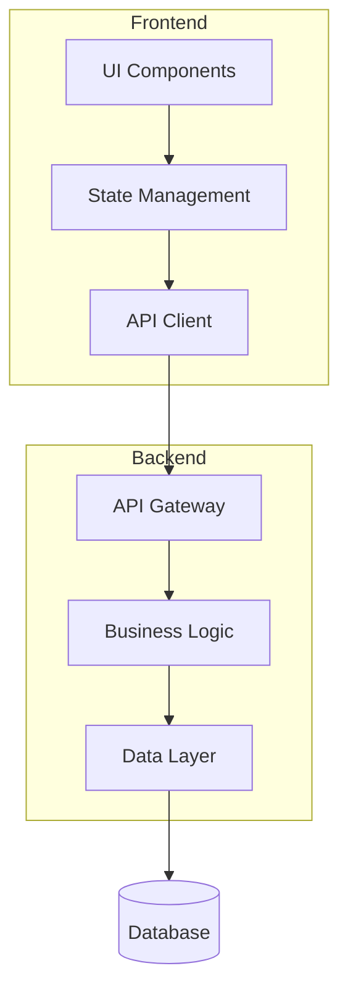

# Design Document - [Nome da Funcionalidade]

## Overview

[Visão geral da solução técnica, abordagem escolhida e principais components]

## Architecture

### High-Level Architecture

### Component Breakdown

#### Component A

- **Purpose**: [Responsabilidade específica]
- **Technology**: [Tecnologia/biblioteca usada]
- **Dependencies**: [Do que depende]

## Data Flow

### Main Flow

1. **Input**: [Entrada do usuário/sistema]
2. **Validation**: [Validações aplicadas]
3. **Processing**: [Processamento realizado]
4. **Storage**: [Como dados são armazenados]
5. **Response**: [Resposta ao usuário]

## Technical Decisions

| Decision  | Alternatives | Rationale               | Trade-offs     |
| --------- | ------------ | ----------------------- | -------------- |
| Library X | Library Y, Z | Performance + community | Learning curve |

## Security Considerations

- **Authentication**: [Como implementado]
- **Authorization**: [Controle de acesso]
- **Data Validation**: [Validações de entrada]
- **Audit Logging**: [Logs de auditoria]

## Performance Considerations

- **Caching Strategy**: [Estratégia de cache]
- **Database Optimization**: [Otimizações]
- **Bundle Size**: [Considerações de tamanho]
